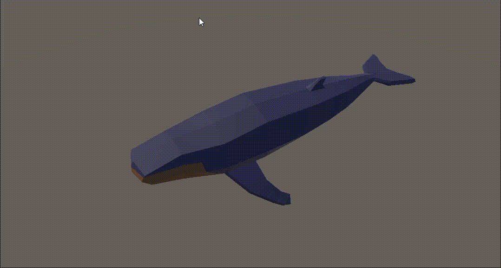
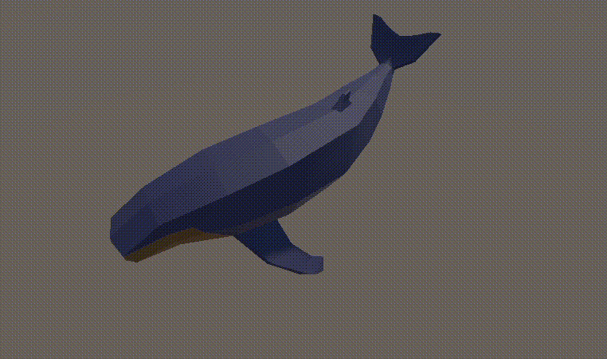
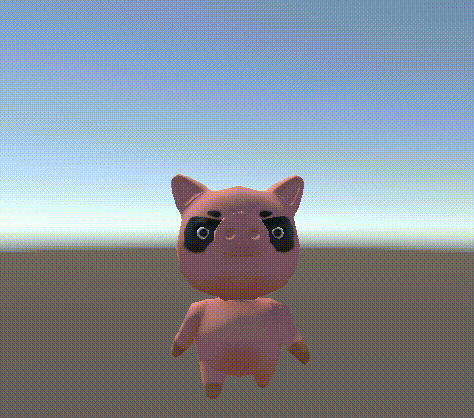
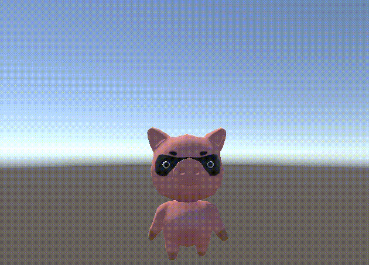
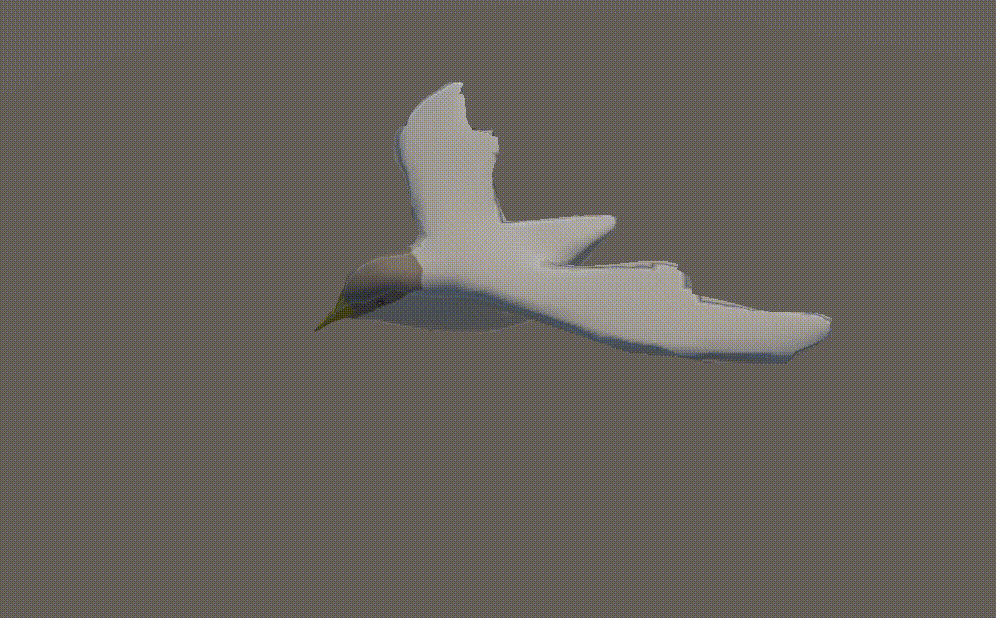
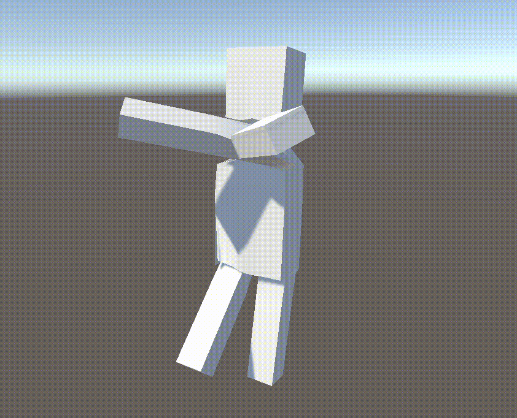

# Real-time Animation Generation and Control on Rigged Models via Large Language Models
 
This repository serves as a showroom for various animations generated by large language models (LLM). Our method takes a rigged 3D model and produces novel animations specified via natural language descriptions in a matter of seconds.

## Animation Generation

The texts in quotes are the prompts used to generate the animation.

### Few-shot

| |   |
| :-------------: | :-------------: | 
| "Tilting its head" for a whale  | "Swimming aggressively" for a whale |

| |   |
| :-------------: | :-------------: | 
| "Eating" for a pig | "Jumping" for a pig |

| |   |
| :-------------: | :-------------: | 
| "Showing disapproval" for a raccoon | "Bowing" for a raccoon  |

### Zero-shot

| |   |   |
| :-------------: | :-------------: | :-------------: | 
| "Flying high and low" for a bird | "Cheering" for a stickman  | "Jumping" for a person  |

## Animation Control

